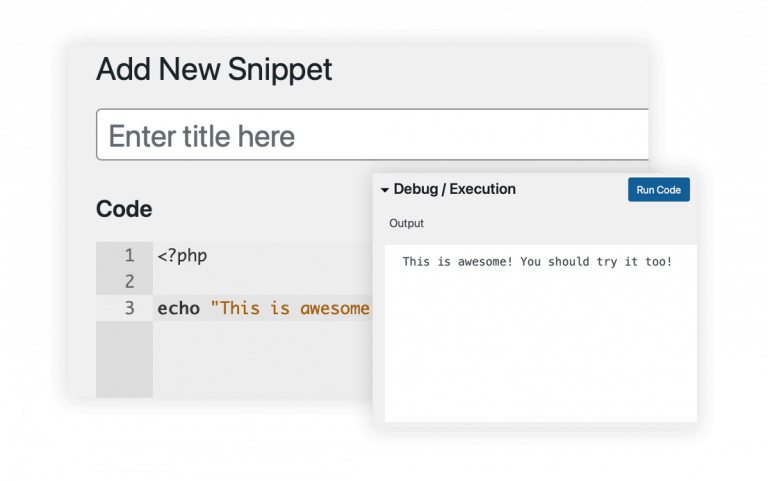
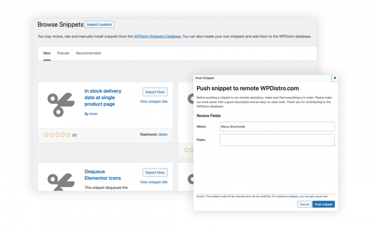
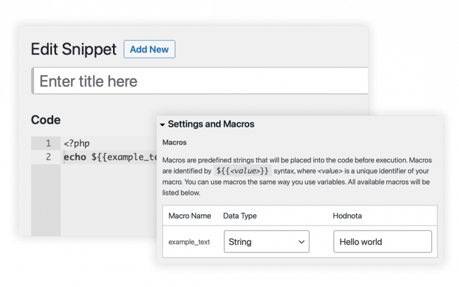

# WPDistro Code Snippets

* __Based on:__ Amazing [Code Snippets](https://github.com/sheabunge/code-snippets) by [Shea Bunge](https://github.com/sheabunge)
* __Requires at least:__ [PHP 7.0](https://www.php.net/downloads.php) or later
* __Stable version:__ [1.0.0]( https://github.com/mozkomor05/wpd-code-snippets/releases/latest/download/wpd-code-snippets.zip)
* __License:__ [MIT](license.txt)

## Table of Contents
1. [Introduction](#introduction)
    - [Remote database](#remote-database)
    - [Macros](#macros)
2. [Installation](#installation)
5. [Issues](#issues)
6. [Contributing](#contributing)
7. [Copyright and attribution](#copyright-and-attribution)

---

## Introduction

Code Snippets is an easy, clean and simple way to run code snippets on your site. It removes the need to add custom snippets to your theme's `functions.php` file.

A snippet is a small chunk of PHP code that you can use to extend the functionality of a WordPress-powered website; essentially a mini-plugin with less load on your site.
Most snippet-hosting sites tell you to add snippet code to your active theme's `functions.php` file, which can get rather long and messy after a while.
Code Snippets changes that by providing a GUI interface for adding snippets and **actually running them on your site** just as if they were in your theme's `functions.php` file.

Code Snippets provides graphical interface, similar to the Plugins menu, for managing snippets. Snippets can can be activated and deactivated, just like plugins. The snippet editor includes fields for a name, a visual editor-enabled description, tags to allow you to categorize snippets, a **full-featured code editor** based on [Ace](https://ace.c9.io) and  **debug console**. Snippets can be exported for transfer to another side, either in JSON for later importing by the Code Snippets plugin, or in PHP for creating your own plugin or theme.

### Remote database

We also provide you with the ability to **share** all of your code snippets with other users. You may not know how to make that little tweak to your favorite plugin. However, it is quite possible that the owner of one of the half a billion active WP installations knows this, and that is why there is our public database of your amazing snippets **verified by us**, from which you can transfer the code to your WP installation with a single click.

You can also browse the snippet database at https://wpdistro.com/snippets-for-wordpress/.

### Macros

We have implemented a system of macros that allows even non-programmers to change variable values to adjust the output of snippets.

## Installation

1. [Download the latest stable release](https://github.com/mozkomor05/wpd-code-snippets/releases/latest/download/wpd-code-snippets.zip)
2. Make sure that the original Shea Bunge's Code Snippet plugin ***is not activated*** or installed.
3. Go to _Plugins_ > _Add New_ and click on _Upload_ button. Select the downloaded zip file and proceed with installation.
4. Activate the plugin in _Installed Plugins_ tab.

## Issues
All issues must be properly labeled - i.e. **enhacement** for feature requests and **bug** for bug reports.

**Bug reporting**

Before reporting a bug have a look at project [current issues](https://github.com/mozkomor05/wpd-code-snippets/issues) in order to avoid duplicates.
Keep titles **short and descriptive** and be **clear and concise**. Don't forget to include steps to **reproduce** the bug and **details about your setup**. If possible, provide **screenshots**.

## Contributing

Please see [CONTRIBUTING.md](./CONTRIBUTING.md).

Any other questions, mail us at info@wpdistro.com. We’d love to meet you!

## Copyright and attribution

Copyright (c) 2021 WPDistro, Released under the [MIT License](https://github.com/mozkomor05/wpd-code-snippets/blob/develop/license.txt).